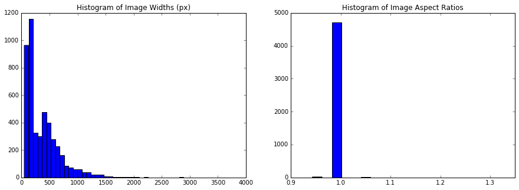

# Plant Seedling Image Classifier

From [this Kaggle competition](https://www.kaggle.com/c/plant-seedlings-classification).
See the full project on GitHub [here](https://github.com/acarl005/mids-w207-final).
All models were implemented in TensorFlow 1.6 (with GPU support).
Training was done on an Ubuntu 16.04 desktop equipped with an Nvidia TitanX GPU, an 8-core Intel i7 CPU, and 64GB of RAM.

## Business Understanding

In this project, we'll take cropped, labelled images of 12 different species of plant seedlings and classify them.
Such a classifier can be a tool used to predict crop yields from images of plants.
Crop yields are important metrics to collect for evaluating the effects of climate change, and assessing the availability of food.
This document describes my approaches to selecting and training a neural network based model to make these classifications.

## Data Understanding

The provided data includes 4750 cropped photos of the plant seedlings as PNGs.
There are three main challenges with the data.

#### 1. Few examples.

Neural networks are notorious for requiring a lot of training data.
4750 is not a lot.
For comparison, [Imagenet](http://www.image-net.org/) has over 14 million images.
This will be addressed with data augmentation.

#### 2. Different image sizes.

These histograms show the distributions of the image dimensions as well as aspect ratios.
As we can see, there is a wide variety of image sizes, and most, but not all, of the images are square.

The number of pixels in the image determines the number of features (3 features per pixel).
Most methods in classification require all examples to have the same number of features.
Therefore, we must pick a size and resize all photos to that size.
The size 224 x 224 pixels is convenient because many established neural networks for image recognition use this size,
such as [AlexNet](https://papers.nips.cc/paper/4824-imagenet-classification-with-deep-convolutional-neural-networks.pdf) and [VGG](http://arxiv.org/pdf/1409.1556v6.pdf).

#### 3. Imbalanced Classes.

In the 12 classes, not all have the same number of examples.
There are much fewer examples for black-grass, common wheat, shepherd's purse, and maize.
This can cause some bias in the classifier, as it is more incentivized to classify things as the classes that appear more frequently in the training set.
This issue was not addressed in these experiments.

## Data Preparation

#### Resizing

Images larger than 224px were simply scaled down.
A couple methods for dealing with smaller image were attempted, including zero-padding and scaling up.
Scaling up performed better in cross validation.
Non-square images were zero-padded to become square.

#### Serialization

After resizing, the PNG images in the training set were serialized as a 4D NumPy array with shape `(4750, 224, 224, 3)`.
The first dimension is the number of examples.
The next two are the height and width of each image.
The last is the number of "channels", or a value for each color in RGB.
The RGB values had a range from 0 to 255, but were divided by 255 to make training faster.

The labels were serialized with a one-hot encoding as a 2D array with shape `(4750, 12)`.

#### Cross Validation Split

A training/dev split of 0.85/0.15 was used.

## Modeling & Evaluation

#### Logistic Regression

A Logistic Regression model with L2 regularization `(beta = 1)` was used.
This is a simple model which is very computationally efficient.

| Train Acc | Dev Acc | Run Time |
|-----------|---------|----------|
| ~50%      | ~37%    | 57s      |

The diagram is generated from Tensorboard.
It shows how the loss and training accuracy change with each batch.
The batch number is on the x-axis.

The logistic regression model is too simplistic.
This is not surprising, as is treats each pixel as an independent feature and has no translational invariance.

#### Multi-layer Perceptron

Next we explored deep learning techniques.
These can learn more complex non-linear patterns as they have many layers.
A multi-layer perceptron was attempted.
Dropout was used with a dropout rate of 30%.

| Train Acc | Dev Acc | Run Time |
|-----------|---------|----------|
| ~66%      | ~50%    | 1m 22s   |

This performs much better.
However, it still suffers from the shortcomings that it treats pixels as independent features.
Instead, [Convolutional Neural Networks](https://en.wikipedia.org/wiki/Convolutional_neural_network) are more commonly used in image recognition.

#### AlexNet

Due to the use of 2D convolutions, the spatial locality of adjacent pixels is preserved, rather than being treated as independent.
It also has translational invariance.
There are many established network architectures.
I'll start with AlexNet, as its relatively simple, and it was the first of its kind to achieve state-of-the-art performance on ImageNet.
Dropout was used with a dropout rate of 50%.

| Train Acc | Dev Acc | Run Time |
|-----------|---------|----------|
| ~96%      | ~81%    | 3m 37s   |

#### AlexNet + Augmentation pt. 1

AlexNet is still showing some over-fitting, which is evident from the fact that the training accuracy is much higher than the cross-validation accuracy.
Dropout is one regularization technique, but increasing it starts to hurt the cross-validation accuracy.
Another method to address over-fitting is to use more training data.
Since we can't obtain any more data from Kaggle, we can simulate more data with a technique known as augmentation.
This entails transforming the examples in various ways, including cropping, reflection, and rotation.
Each of the training examples was reflected vertically.
Then, each of these was rotated 90, 180, and 270 degrees.
This increased the training set size by a factor of 8, yielding a set of 32304 images.

The same AlexNet architecture was trained on this data.

| Train Acc | Dev Acc | Run Time |
|-----------|---------|----------|
| ~93%      | ~87%    | 17m 4s   |

This helped to mitigate the over-fitting and increase the cross-validation accuracy.
Let's see how far we can take this.

#### AlexNet + Augmentation pt. 2

Each of the 32304 images were rotated by 30 degrees, doubling the data to a size of 64608.
AlexNet was then trained again.

| Train Acc | Dev Acc | Run Time |
|-----------|---------|----------|
| ~92%      | ~89%    | 34m 17s  |

This shows yet another improvement, but not as significant.
Perhaps the architecture is now saturated, i.e. there aren't enough parameters to continue learning more complex patterns.

##### Memory Issues

At this point, the program is consuming about 60GB of memory.
The machine I'm training on has 64GB of RAM.
Some memory is getting moved into SWAP, like the memory allocated to the child processes by the `image_loader`.
Fortunately, `kswapd0` (the daemon responsible for moving things in and out of SWAP), was not busy during the training process,
so the speed of training wasn't affected.
However, it does mean I've hit a limit for the amount of augmentation I can do on the data while keeping it all in main memory.

#### ResNet-50

Since AlexNet may have been saturated, I'll try one with more parameters.
[ResNet-50](https://arxiv.org/abs/1512.03385) is an architecture by Google which achieved state-of-the-art performance on ImageNet at the time of discovery.
It was deeper than all previous contenders.
The "residual connections" were credited to its success, allowing gradients to pass through more layers during training and enabling a deeper architecture.

| Train Acc | Dev Acc | Run Time |
|-----------|---------|----------|
| ~98%      | ~92%    | 1h 50m   |

This gave the best performance in cross-validation.

## Deployment

The unlabelled test data was downloaded and predictions were run using the trained ResNet-50 model.
A CSV of filenames and predicted classes was submitted to the public leaderboard of Kaggle.
The test accuracy is 92%, furnishing a ranking of 528/836.

| Model                       | Train Acc | Dev Acc | Run Time |
|-----------------------------|-----------|---------|----------|
| Logistic Regression         | ~50%      | ~37%    | 57s      |
| Multi-layer Perceptron      | ~66%      | ~50%    | 1m 22s   |
| AlexNet                     | ~96%      | ~81%    | 3m 37s   |
| AlexNet + augment 1         | ~93%      | ~87%    | 17m 4s   |
| AlexNet + augment + augment | ~92%      | ~89%    | 34m 17s  |
| ResNet-50                   | ~98%      | ~92%    | 1h 50m   |

## Appendix

#### Confusion Matrix

There is one cell here that clearly stands out. Black-grass gets mistaken for Loose Silky-bent a lot. Let's plot some examples of each class to see why they might get commonly confused.

The two classes look very similar.
This will make them difficult to differentiate.
I can't even do it by eye.
To make things worse, we saw in part 1 that there are relatively few examples for Black-grass, and more than double the number of Loose Silky-bent.
This explains why Black-grass gets commonly mistaken for Loose Silky-Bent, but not the other way around. To address this issue, we could do the data augmentation differently. Before, the same number of transformations were applied on all exampled in the training set. Instead, we could try "evening things out" by applying more transformations to the classes with fewer examples.

#### Plotting the "Biggest Mistakes"

We found the 30 "biggest mistakes" by seeing which of the dev examples produced the highest cost value.

 
In these examples, there are a lot of examples of Black-grass confused as Loose Silky-bent.
This was expected from the confusion matrix.
There are a few examples of grainy, poorly lit photos.
However, the biggest issue here seems to be that the small photos are contributing disproportionately more to the loss.
Remember that the photos smaller than 224x224 were scaled up.
There is relatively less information in the smaller photos, and scaling up doesn't fix that issue.
Perhaps there is a better way to pre-process the smaller photos.
Zero-padding was attempted but gave worse accuracy.
This effectively fills the extra space with black surrounding the image to make it the desired size.
Perhaps the giant sections of black were causing issues.
We could pad with other things, like synthesizing background, to make the photos look the same as the original distribution.
For this, I could train a GAN to generate some background.
Another alternative is to try to remove the background. Maybe using only the green channel is adequate since most of the green is in the leaves.

#### Ideas to Improve Accuracy
- Use more augmentation on classes with fewer examples (especially Black-grass), to balance the classes.
- Instead of scaling the small images, pad with synthesized background.
- Don't keep all the images in memory at once. Load the images in batches to avoid hitting memory limits. This would slow down training, but allow us to synthesize even more data.
- Use only the green channels from the images for training and prediction.

